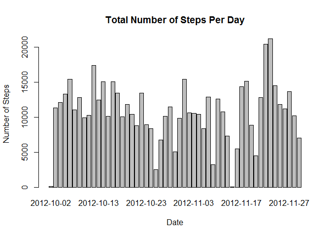
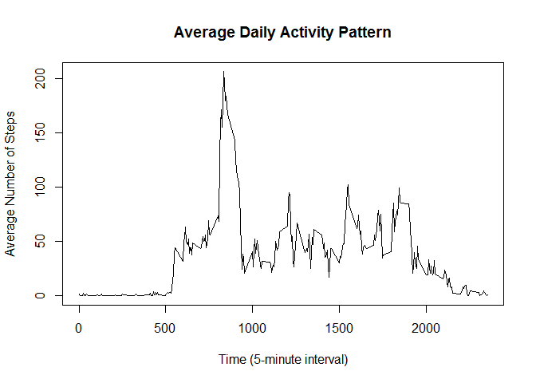
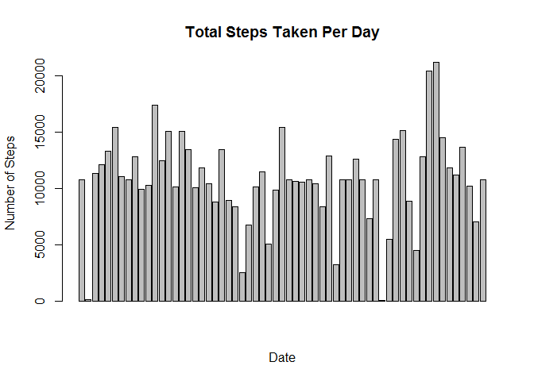
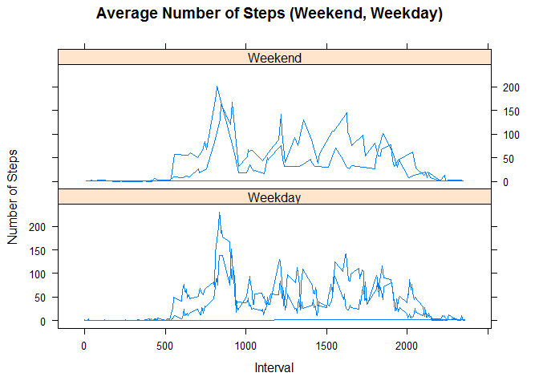

# Reproducible Research: Peer Assessment 1


## Loading and preprocessing the data

```r
# Setting up the working directory
setwd("C:/Users/Miah Alexa/Documents/Coursera - Data Science Specialization Track/Reproducible Research/Week 2/Coursework")

# Loading and preprocessing the dataset
unzip("activity.zip")
data <- read.csv("activity.csv", stringsAsFactors = FALSE)
```


## What is mean total number of steps taken per day?


```r
# Converting date
data$date <- as.Date(data$date, format = "%Y-%m-%d")

# Calculating how many steps taken each day
stepsPerDay <- aggregate(steps ~ date, data = data, FUN = sum, na.rm = TRUE)

# Creating the barplot
barplot(stepsPerDay$steps, names.arg = stepsPerDay$date,
              xlab = "Date",
              ylab = "Number of Steps",
              main = "Total Number of Steps Per Day"
        )
```

 

Calculate and report the mean and median total number of steps taken per day.

```r
# Calculate the mean 
mean(stepsPerDay$steps, na.rm = TRUE)
```

```
## [1] 10766.19
```

```r
# Calculate the median
median(stepsPerDay$steps, na.rm = TRUE)
```

```
## [1] 10765
```

## What is the average daily activity pattern?


```r
# Make a time series plot (i.e. type = "l") of the 5-minute interval (x-axis)
# and the average number of steps taken, averaged across all days (y-axis)

stepsInterval <- aggregate(steps ~ interval, data = data, FUN = mean)

# Plotting the graph
plot(stepsInterval,
        main = "Average Daily Activity Pattern",
        xlab = "Time (5-minute interval)",
        ylab = "Average Number of Steps",
        type = "l"
     )
```

 

Which 5-minute interval, on average across all the days in the dataset, contains the maximum number of steps?

```r
stepsInterval$interval[which.max(stepsInterval$steps)]
```

```
## [1] 835
```

## Imputing missing values

Calculate and report the total number of missing values in the dataset (i.e. the total number of rows with NAs)

```r
sum(is.na(data))
```

```
## [1] 2304
```

Devise a strategy for filling in all of the missing values in the dataset. The strategy does not need to be sophisticated. For example, you could use the mean/median for that day, or the mean for that 5-minute interval, etc.

```r
# Creating a new data set with the missing data filled in
data <- merge(data, stepsInterval, by = "interval", suffixes = c("", ".y"))
missingValues <- is.na(data$steps)
data$steps[missingValues] <- data$steps.y[missingValues]
data <- data[, c(1:3)]

# Plotting the graph
stepsTotal <- aggregate(steps ~ date, data = data, FUN = sum)
barplot(stepsTotal$steps, names.arg = stepsTotal$data,
              main = "Total Steps Taken Per Day",
              xlab = "Date",
              ylab = "Number of Steps"
        )
```

 

Calculate and report the mean and median total number of steps taken per day. Do these values differ from the estimates from the first part of the assignment? What is the impact of imputing missing data on the estimates of the total daily number of steps?

```r
# Calculate the mean
mean(stepsTotal$steps)
```

```
## [1] 10766.19
```

```r
# Calculate the median
median(stepsTotal$steps)
```

```
## [1] 10766.19
```

## Are there differences in activity patterns between weekdays and weekends?

Create a new factor variable in the dataset with two levels – “weekday” and “weekend” indicating whether a given date is a weekday or weekend day.

```r
day <- weekdays(data$date)
dayType <- vector()
for(i in 1:nrow(data)) {
  if (day[i] == "Saturday") {
    dayType[i] <- "Weekend"
  } else if (day[i] == "Sunday") {
    dayType[i] <- "Weekend"
  } else {
    dayType[i] <- "Weekday"
  }
}

data$dayType <- dayType
data$dayType <- factor(data$dayType)

stepsByDay <- aggregate(steps ~ interval + dayType, data = data, FUN = mean)
names(stepsByDay) <- c("interval", "daytype", "steps")


# Plotting the graph
library(lattice)
xyplot(steps ~ interval | dayType, stepsByDay,
            main = "Average Number of Steps (Weekend, Weekday)",
            xlab = "Interval",
            ylab = "Number of Steps",
            type = "l", 
            layout = c(1, 2),
       )
```

 
